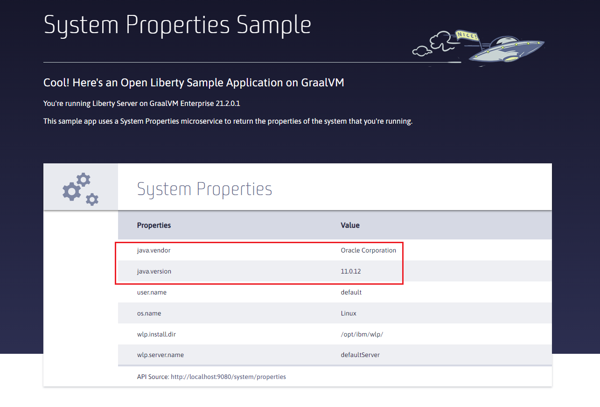
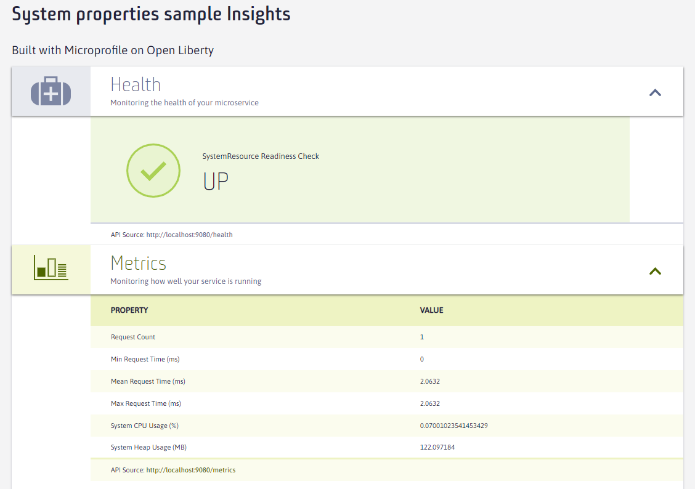

# Creating a Liberty Server Sample Image with GraalVM

In this basic example, you'll create a simple REST microservice running on Open Liberty, using GraalVM.  The goal with this example is to package the application along with the server configuration into a GraalVM-based container image.

Let's get started!

Begin by cloning the sample repository:
```
$ git clone https://github.com/swseighman/Liberty-GraalVM-Sample.git
```
Change to the sample application directory and compile the application:
```
$ cd Liberty-GraalVM-Sample
$ mvn package
```
In the `target` directory, you should see an application called `guide-getting-started.war`.  For reference, in the `src/main/resources` directory you'll find the Liberty Server configuration file (`server.xml`).

Next, build the container image:
```
$ docker build -t liberty-21:graalvm .
```

Run the container (notice it's running on GraalVM):
```
$ docker run -p 9080:9080 liberty-21:graalvm
Launching defaultServer (WebSphere Application Server 21.0.0.10/wlp-1.0.57.cl211020210920-1900) on Java HotSpot(TM) 64-Bit Server VM, version 11.0.12+8-LTS-jvmci-21.2-b06 (en_US)
<snip> ...
```
Included in this sample is a basic application that shows various server properties. In your browser, go to [http://localhost:9080/](http://localhost:9080/)

You'll see the `java.vendor` property is **Oracle Corporation** and the `java.version` is **11.0.12**:



The Health and Metrics endpoints are also enabled, scroll down the page and click on the associated icons to reveal the Readiness status and Service metrics:



Congratulations!  You now have a Liberty Server running on GraalVM with a sample application.  Try some benchmarks to compare performance against your previous Java runtime.
